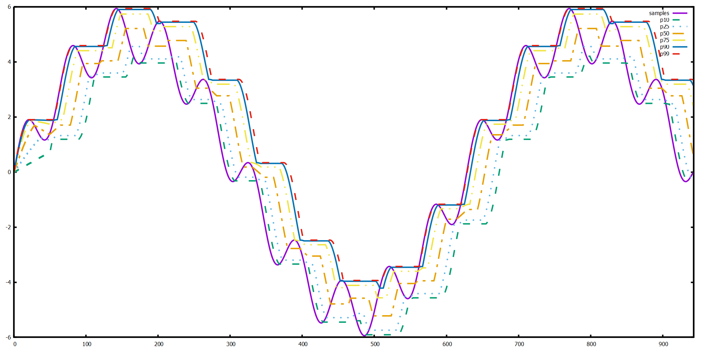
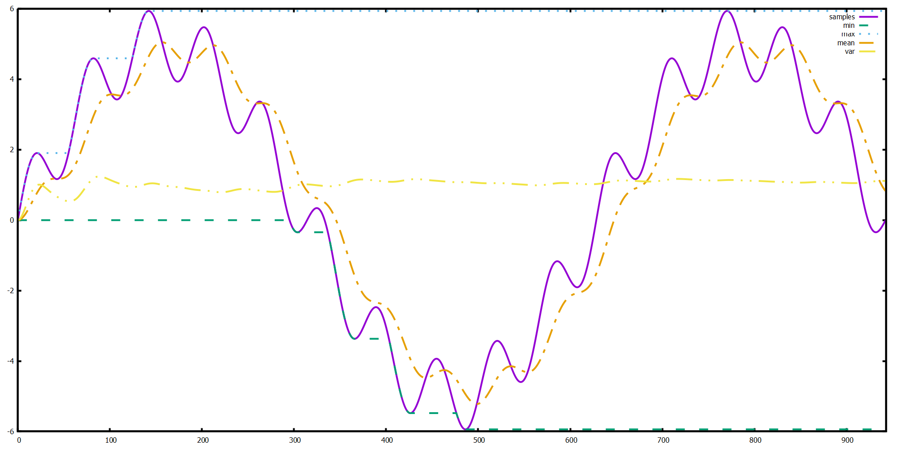

# go-mwnd
[](https://codecov.io/gh/davidbacisin/go-mwnd) [](https://buymeacoffee.com/davidbacisin)

Moving window order statistics for Go. Computes mean, minimum, maximum, and population 
variance over a sliding window, supporting both fixed-size and 
exponentially-weighted windows. The fixed-size window also supports computing any quantile.

## Usage 🚀
```go
// Define a fixed moving window that holds up to 5 values
w := mwnd.Fixed[int](5)

// Note that len(values) > w.Size(), so when the last value (10) is Put,
// then the first value (1) will be evicted.
values := []int{1, 5, 4, 3, 2, 10}
for _, v := range values {
    w.Put(v)
}

fmt.Printf("Size: %d\n", w.Size())
fmt.Printf("Min: %d\n", w.Min())
fmt.Printf("Max: %d\n", w.Max())
fmt.Printf("Mean: %.2f\n", w.Mean())
fmt.Printf("Variance: %.2f\n", w.Variance())
fmt.Printf("Median: %d\n", w.Quantile(0.5))
```

## Example visualizations 📊
The following plot shows generated data (solid purple line) and the moving min, max, mean, and variance 
for a fixed window of 500 values:


Plotted below are the first and ninth deciles, all quartiles, and 99th percentile of the same data set and fixed window parameters:


The following plot shows the same data with statistics from an exponentially-weighted moving window 
with alpha = 0.004:


Note especially the differences in min, max, and variance between these two implementations: as a result,
they are not interchangeable and instead can only approximate each other.

## Limitations and Future Work 🧪
- The moving window implementations are not safe for concurrent reads or writes. Consider using 
[`sync.Mutex`](https://pkg.go.dev/sync#Mutex) or [`sync.RWMutex`](https://pkg.go.dev/sync#RWMutex) 
to synchronize access under a concurrent workload.
- **Random sampling**: In some cases, it may be impractical to include every value 
in the window. Instead, a random subset could be probabilistically sampled. The variance 
calculation would need to be corrected for bias.

## Benchmarks
Last updated 2025-08-20 from a run in Github Actions.
```
goos: linux
goarch: amd64
pkg: github.com/davidbacisin/go-mwnd
cpu: AMD EPYC 7763 64-Core Processor                
BenchmarkExponential-4                           	88175295    13.67 ns/op    0 B/op    0 allocs/op
BenchmarkFixed_1000-4                           	 6180193    194.0 ns/op    0 B/op    0 allocs/op
BenchmarkFixed_1000_Quantiles/first_percentile-4 	 6031942    199.1 ns/op    0 B/op    0 allocs/op
BenchmarkFixed_1000_Quantiles/first_decile-4     	 5875854    204.3 ns/op    0 B/op    0 allocs/op
BenchmarkFixed_1000_Quantiles/first_quartile-4   	 5807490    206.5 ns/op    0 B/op    0 allocs/op
BenchmarkFixed_1000_Quantiles/median-4           	 5755824    209.0 ns/op    0 B/op    0 allocs/op
BenchmarkFixed_1000_Quantiles/third_quartile-4   	 5788407    207.5 ns/op    0 B/op    0 allocs/op
BenchmarkFixed_1000_Quantiles/ninth_decile-4     	 5815921    206.1 ns/op    0 B/op    0 allocs/op
BenchmarkFixed_1000_Quantiles/99th_percentile-4  	 5896506    200.7 ns/op    0 B/op    0 allocs/op
```
