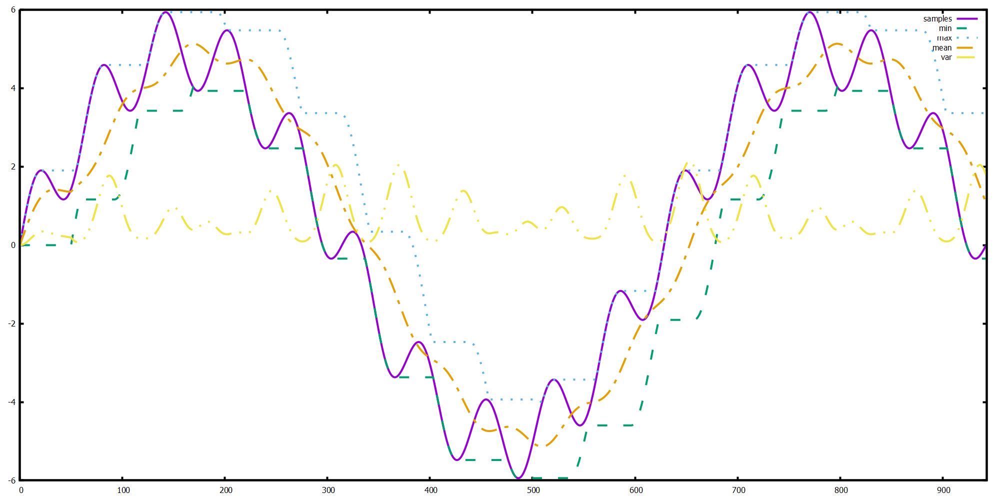

# go-mwnd
Moving window statistics for Go. Computes mean, minimum, maximum, and total sum of squared 
differences from the mean over a sliding window of a fixed number of samples. When the window 
is full, the oldest sample is removed when a new sample is added.

## Usage
```go
// Define a moving window that holds up to 5 samples
w := mwnd.Fixed[int](5)

// Note that len(values) > w.Size(), so when the last value (10) is Put,
// then the first value (1) will be evicted.
values := []int{1, 5, 4, 3, 2, 10}
for _, v := range values {
    w.Put(v)
}

fmt.Printf("Size: %d\n", w.Size())
fmt.Printf("Min: %d\n", w.Min())
fmt.Printf("Max: %d\n", w.Max())
fmt.Printf("Mean: %.2f\n", w.Mean())
fmt.Printf("Total Sum of Squares: %.2f\n", w.TotalSumSquares())
```

## Example visualization
The following plot shows generated sample data (solid purple line) and the moving min, max, and mean 
for a fixed window of 500 samples:


## Limitations and Future Work
- The moving window implementation is not safe for concurrent reads or writes. Consider using 
[`sync.Mutex`](https://pkg.go.dev/sync#Mutex) or [`sync.RWMutex`](https://pkg.go.dev/sync#RWMutex) 
to synchronize access under a concurrent workload.
- **Random sampling**: In some cases, it may be impractical to include every sample 
in the window. Instead, a random subset could be probabilistically sampled.
